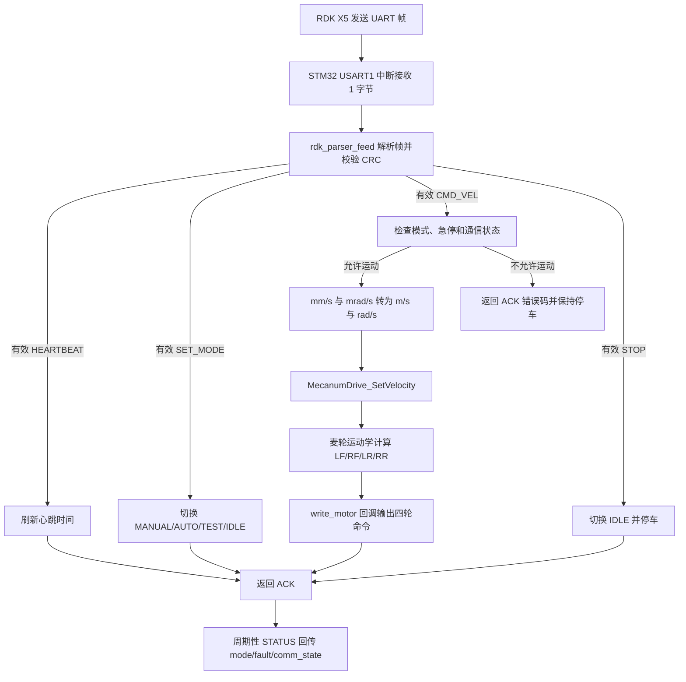

# RDK X5 控制 STM32 麦轮底盘流程设计

日期：2026-05-12

## 目标

在不破坏现有 UART 协议收发、ACK、STATUS 回传能力的前提下，把 RDK X5 到 STM32 的 `CMD_VEL` 控制链路接入四轮麦克纳姆底盘控制。第一阶段只完成软件流程合并和可测试接口，PWM/DIR 具体引脚与 TIM 通道等硬件输出保持为可替换回调，待实物 pinmap 确认后再接入。

## 范围

本阶段包含：

- 将麦轮底盘驱动纳入 `stm32_motion_controller` 工程的 `Core/Inc` 与 `Core/Src`。
- 保留现有 `rdk_stm32_uart` 帧格式、CRC 校验、解析器、ACK 和 STATUS 回传。
- 让 `CMD_VEL` 在非 `IDLE` 模式下进入运动控制层，最终调用麦轮运动学驱动。
- 在 `STOP`、`IDLE`、命令超时、心跳超时、急停状态下统一停车。
- 增加离线 C 单元测试，验证 UART 命令能触发底盘输出接口，异常状态能停车。

本阶段不包含：

- 不配置或假设具体 PWM/DIR 引脚。
- 不生成或重写 CubeMX 的 TIM/GPIO 配置。
- 不接编码器闭环、里程计融合、ROS2 控制节点。
- 不改变 RDK X5 端既有协议脚本的帧格式。

## 总体流程

## 模块边界

### UART 协议层

`rdk_stm32_uart.c/h` 继续只负责帧编码、解码、CRC、payload pack/unpack。它不直接控制电机，避免协议层和硬件输出耦合。

### 应用调度层

`main.c` 保持为 CubeMX 生成代码的集成点，只在 USER CODE 区域维护：

- UART 接收启动与回调。
- `dispatch_frame()` 命令分发。
- 状态机变量、通信超时检查、STATUS 周期回传。
- 运动控制初始化、命令转换、停车调用。

### 麦轮驱动层

`mecanum_drive.c/h` 负责：

- `vx/vy/wz` 到四轮速度的麦轮运动学转换。
- 速度限幅、PWM 比例换算、方向反转配置。
- 控制帧超时停车。
- 通过 `write_motor` 回调交给硬件层输出。

### 硬件输出层

第一阶段使用空实现或测试捕获回调，保证软件链路可验证。后续 pinmap 确认后，把 `write_motor` 改为实际 TIM PWM 与 DIR GPIO 输出。

## 状态与安全策略

- 上电默认 `IDLE`，四轮输出为 0。
- `CMD_VEL` 只有在 `MANUAL`、`AUTO` 或 `TEST` 模式下有效。
- `STOP` 立即切回 `IDLE` 并调用停车。
- 命令超时和心跳超时由主循环周期检查，触发后停车并更新 `comm_state` 与 `fault_code`。
- 急停状态下拒绝新的 `CMD_VEL`，返回 `RDK_ACK_ESTOP_ACTIVE`，并保持四轮输出为 0。
- CRC、长度或版本错误不进入运动控制层。

## 数据转换

RDK 协议继续使用：

- `vx_mm_s`
- `vy_mm_s`
- `wz_mrad_s`

进入麦轮驱动前转换为：

- `vx_mps = vx_mm_s / 1000.0f`
- `vy_mps = vy_mm_s / 1000.0f`
- `wz_radps = wz_mrad_s / 1000.0f`

四轮顺序固定为 `LF, RF, LR, RR`，与 `docs/hardware/pinmap.md` 和 `stm32/docs/mecanum_drive.md` 保持一致。

## 验证流程

1. 增加或更新 C 单元测试，确认 `mecanum_drive` 能独立编译并输出四轮命令。
2. 增加主程序集成文本检查，确认 `main.c` 包含 `mecanum_drive.h`、初始化、`CMD_VEL` 调用和停车路径。
3. 运行 `python3 -m unittest discover -s tests`，确认现有 UART、RDK 脚本、模拟器测试不回退。
4. 在无电机环境下，用测试回调确认 `CMD_VEL vx > 0` 能产生四路非零命令，`STOP` 和超时能清零。
5. 后续硬件接线确认后，再逐步接入实际 TIM/GPIO，并按空载、单电机、四轮悬空、低速落地顺序验证。

## 实施顺序

1. 复制或迁移 `mecanum_drive.c/h` 到 `stm32_motion_controller/Core`，纳入 CubeIDE 编译路径。
2. 在 `main.c` USER CODE 区域增加底盘控制对象、配置和空硬件输出回调。
3. 在初始化阶段启动 UART 前初始化麦轮底盘。
4. 在 `CMD_VEL` 分支中将协议命令转换为麦轮速度命令。
5. 在 `STOP`、`IDLE`、超时和急停路径调用统一停车函数。
6. 扩展测试覆盖协议到控制链路的关键路径。
